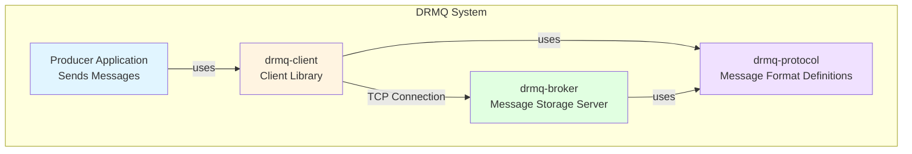
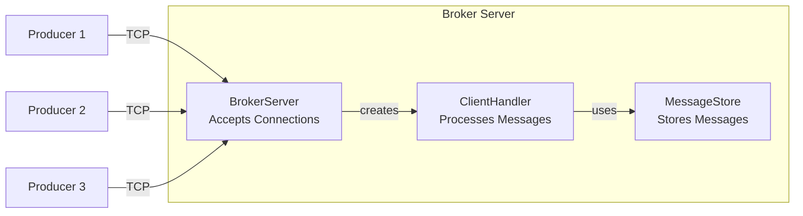

# DRMQ: Distributed Reliable Message Queue - Complete Documentation

> **For Beginners**: This documentation is written to be understood by first-year computer science students and even non-technical readers. We'll explain every concept from the ground up!

---

## Table of Contents

1. [What is DRMQ?](#what-is-drmq)
2. [Why Do We Need Message Queues?](#why-do-we-need-message-queues)
3. [Project Architecture Overview](#project-architecture-overview)
4. [How to Build and Run](#how-to-build-and-run)
5. [Module 1: Protocol Layer](#module-1-protocol-layer)
6. [Module 2: Broker Server](#module-2-broker-server)
7. [Module 3: Client Library](#module-3-client-library)
8. [Module 4: Testing](#module-4-testing)
9. [Complete Code Walkthrough](#complete-code-walkthrough)
10. [Key Concepts Explained](#key-concepts-explained)

---

## What is DRMQ?

**DRMQ** stands for **Distributed Reliable Message Queue**. It's a system that helps different computer programs communicate with each other by sending messages.

### Real-World Analogy

Think of DRMQ like a post office:
- **Producers** are like people who write letters (messages)
- The **Broker** is like the post office that receives, stores, and organizes letters
- **Topics** are like different mailboxes (e.g., "bills", "personal letters", "advertisements")
- **Consumers** (not yet implemented in Phase 1) are like people who read the letters

When you send a letter to the post office, you don't need to wait for the recipient to be home. The post office stores it safely until it's delivered. Similarly, DRMQ stores messages so that the sender and receiver don't need to be active at the same time.

---

## Why Do We Need Message Queues?

### Problem: Direct Communication is Fragile

Imagine you have two programs:
- **Program A**: An online store that processes orders
- **Program B**: An inventory system that updates stock levels

**Without a message queue:**
```
Online Store → (direct connection) → Inventory System
```

Problems:
1. If the inventory system crashes, the online store can't send updates
2. If the online store sends 1000 updates at once, the inventory system might get overwhelmed
3. Both systems must be running at the same time

**With a message queue (DRMQ):**
```
Online Store → DRMQ Broker → Inventory System
```

Benefits:
1. If the inventory system crashes, messages wait safely in DRMQ
2. The inventory system can process messages at its own pace
3. Systems can be updated independently without breaking communication
4. Multiple systems can subscribe to the same messages

---

## Project Architecture Overview

DRMQ is built as a **multi-module Maven project**. Think of it like a building with different floors, each serving a specific purpose.



### The Four Modules

| Module | Purpose | Analogy |
|--------|---------|---------|
| **drmq-protocol** | Defines how messages are formatted | The language/grammar that everyone agrees to use |
| **drmq-broker** | Stores and manages messages | The post office building with storage |
| **drmq-client** | Library for sending messages | The mail service you use to send letters |
| **drmq-integration-tests** | Tests that everything works together | Quality inspectors checking the whole system |

---

## How to Build and Run

### Prerequisites

You need to have installed:
- **Java 17** or higher (the programming language)
- **Maven** (a build tool that compiles and packages Java code)

### Building the Project

Open a terminal in the DRMQ directory and run:

```bash
mvn clean install
```

**What this does:**
1. `clean` - Deletes old compiled files
2. `install` - Compiles all modules and installs them locally

### Running the Broker

```bash
cd drmq-broker
mvn exec:java
```

This starts the broker server on port 9092 (the default port).

**You should see:**
```
[INFO] DRMQ Broker started on port 9092
```

### Using the Client (Example)

Create a simple Java program:

```java
import com.drmq.client.DRMQProducer;

public class MyFirstMessage {
    public static void main(String[] args) throws Exception {
        // Create a producer that connects to localhost:9092
        try (DRMQProducer producer = new DRMQProducer()) {
            // Send a message to the "greetings" topic
            var result = producer.send("greetings", "Hello, DRMQ!");
            
            System.out.println("Message sent! Offset: " + result.getOffset());
        }
    }
}
```

---

## Module 1: Protocol Layer

**Location:** `drmq-protocol/`

### What is a Protocol?

A **protocol** is a set of rules for how computers communicate. It's like agreeing that when you say "hello", you expect "hi" back, not "banana".

### Why Protocol Buffers?

DRMQ uses **Protocol Buffers** (protobuf), a technology created by Google. It's a way to:
1. Define the structure of messages
2. Serialize (convert) messages into bytes for sending over the network
3. Deserialize (convert back) bytes into usable objects

**Analogy:** Think of it like a form with specific fields. Everyone filling out the form knows exactly what goes where.

### The Message Definitions

File: [`messages.proto`](file:///home/samuel/Documents/DRMQ/drmq-protocol/src/main/proto/messages.proto)

```protobuf
syntax = "proto3";

package com.drmq.protocol;

option java_package = "com.drmq.protocol";
option java_outer_classname = "DRMQProtocol";
```

**Explanation:**
- `syntax = "proto3"` - We're using version 3 of Protocol Buffers
- `package` - Organizes our code (like folders)
- `java_package` - Where the generated Java code will go
- `java_outer_classname` - The name of the generated Java class

#### Message Type 1: ProduceRequest

```protobuf
message ProduceRequest {
    string topic = 1;
    bytes payload = 2;
    optional string key = 3;
    int64 timestamp = 4;
}
```

**What it means:**
- `topic` (field 1): The name of the topic (like "orders" or "notifications")
- `payload` (field 2): The actual message content as bytes
- `key` (field 3): Optional - used for organizing related messages
- `timestamp` (field 4): When the message was created (in milliseconds since 1970)

**Example in real life:**
```
Topic: "pizza-orders"
Payload: "1 large pepperoni pizza"
Key: "customer-12345"
Timestamp: 1707217371000
```

#### Message Type 2: ProduceResponse

```protobuf
message ProduceResponse {
    bool success = 1;
    int64 offset = 2;
    string error_message = 3;
}
```

**What it means:**
- `success`: Did the message get stored successfully? (true/false)
- `offset`: The unique ID assigned to this message (like a tracking number)
- `error_message`: If something went wrong, what was the error?

#### Message Type 3: StoredMessage

```protobuf
message StoredMessage {
    int64 offset = 1;
    string topic = 2;
    bytes payload = 3;
    optional string key = 4;
    int64 timestamp = 5;
    int64 stored_at = 6;
}
```

**What it means:**
This is the internal format the broker uses to store messages. It includes:
- Everything from the ProduceRequest
- `offset`: The unique ID assigned by the broker
- `stored_at`: When the broker received and stored it

#### Message Type 4: MessageEnvelope

```protobuf
message MessageEnvelope {
    MessageType type = 1;
    bytes payload = 2;
}

enum MessageType {
    UNKNOWN = 0;
    PRODUCE_REQUEST = 1;
    PRODUCE_RESPONSE = 2;
    CONSUME_REQUEST = 3;
    CONSUME_RESPONSE = 4;
    HEARTBEAT = 5;
}
```

**What it means:**
An envelope wraps other messages and tells the receiver what type of message is inside. It's like writing "INVOICE" or "PERSONAL" on the outside of an envelope.

**Why we need it:**
When the broker receives bytes over the network, it needs to know: "Is this a produce request? A consume request? Something else?" The envelope answers that question.

### How Protocol Buffers Work

**Step 1: Define the structure** (messages.proto)
```protobuf
message ProduceRequest {
    string topic = 1;
    bytes payload = 2;
}
```

**Step 2: Compile to Java** (done by Maven)
```bash
protoc --java_out=target/generated-sources messages.proto
```

**Step 3: Use in Java code**
```java
// Create a message
ProduceRequest request = ProduceRequest.newBuilder()
    .setTopic("orders")
    .setPayload(ByteString.copyFrom("order data".getBytes()))
    .build();

// Serialize to bytes
byte[] bytes = request.toByteArray();

// Send bytes over network...

// Deserialize back to object
ProduceRequest received = ProduceRequest.parseFrom(bytes);
```

---

## Module 2: Broker Server

**Location:** `drmq-broker/`

The broker is the heart of DRMQ. It's a server that:
1. Accepts connections from producers
2. Receives messages
3. Stores messages in memory (Phase 1)
4. Assigns unique offsets to each message
5. Sends back confirmations

### Architecture



### Component 1: BrokerServer

**File:** [`BrokerServer.java`](file:///home/samuel/Documents/DRMQ/drmq-broker/src/main/java/com/drmq/broker/BrokerServer.java)

**Purpose:** The main server that listens for incoming connections.

#### Key Concepts

**1. ServerSocket - The Listening Door**

```java
ServerSocket serverSocket = new ServerSocket(port);
```

Think of a `ServerSocket` as a door that's always open, waiting for visitors. When someone knocks (a client tries to connect), the door opens and lets them in.

**2. Thread Pool - Multiple Workers**

```java
ExecutorService executor = Executors.newFixedThreadPool(threadPoolSize);
```

A **thread** is like a worker who can handle tasks. A **thread pool** is a team of workers. Instead of hiring a new worker for each customer (which is expensive), we have a fixed team that handles customers as they arrive.

**Default:** 10 workers (threads)

**3. The Main Loop - Always Listening**

```java
while (running) {
    Socket clientSocket = serverSocket.accept();  // Wait for a client
    ClientHandler handler = new ClientHandler(clientSocket, messageStore);
    executor.submit(handler);  // Assign a worker to handle this client
}
```

**What happens:**
1. `accept()` blocks (waits) until a client connects
2. When a client connects, we get a `Socket` (a two-way communication channel)
3. We create a `ClientHandler` to manage this specific client
4. We give the handler to a worker thread to process

#### Code Walkthrough

**Starting the Broker:**

```java
public void start() throws IOException {
    serverSocket = new ServerSocket(port);  // Open the door on port 9092
    running = true;  // Set the "open for business" flag

    logger.info("DRMQ Broker started on port {}", port);

    while (running) {  // Keep accepting clients until shutdown
        try {
            Socket clientSocket = serverSocket.accept();  // Wait for client
            ClientHandler handler = new ClientHandler(clientSocket, messageStore);
            
            synchronized (activeHandlers) {  // Thread-safe list management
                activeHandlers.add(handler);
            }
            
            executor.submit(handler);  // Process in background
        } catch (IOException e) {
            if (running) {  // Only log if we're still supposed to be running
                logger.error("Error accepting connection", e);
            }
        }
    }
}
```

**Graceful Shutdown:**

```java
public void shutdown() {
    logger.info("Shutting down broker...");
    running = false;  // Stop accepting new connections

    // Close the listening socket
    if (serverSocket != null && !serverSocket.isClosed()) {
        serverSocket.close();
    }

    // Stop all active client handlers
    synchronized (activeHandlers) {
        for (ClientHandler handler : activeHandlers) {
            handler.stop();
        }
        activeHandlers.clear();
    }

    // Shutdown the thread pool
    executor.shutdown();
    if (!executor.awaitTermination(5, TimeUnit.SECONDS)) {
        executor.shutdownNow();  // Force shutdown if taking too long
    }
}
```

**Why graceful shutdown matters:**
- Clients get a chance to finish their current operations
- No messages are lost mid-processing
- Resources (sockets, threads) are properly cleaned up

### Component 2: ClientHandler

**File:** [`ClientHandler.java`](file:///home/samuel/Documents/DRMQ/drmq-broker/src/main/java/com/drmq/broker/ClientHandler.java)

**Purpose:** Handles communication with a single connected client.

#### The Communication Protocol

Messages are sent using **length-prefixed framing**:

```
[4 bytes: length] [N bytes: message data]
```

**Example:**
```
[0x00, 0x00, 0x00, 0x0A] [10 bytes of protobuf data]
```

**Why we need this:**
TCP is a **stream protocol** - it sends a continuous flow of bytes without boundaries. We need a way to know where one message ends and the next begins.

**Analogy:** Imagine receiving a long string of words without spaces: "hellohowdoyoudotoday". You need markers to know where each word starts and ends.

#### Code Walkthrough

**The Main Processing Loop:**

```java
@Override
public void run() {
    String clientAddress = socket.getRemoteSocketAddress().toString();
    logger.info("Client connected: {}", clientAddress);

    try (DataInputStream in = new DataInputStream(new BufferedInputStream(socket.getInputStream()));
         DataOutputStream out = new DataOutputStream(new BufferedOutputStream(socket.getOutputStream()))) {

        while (running && !socket.isClosed()) {
            try {
                // Step 1: Read the length (4 bytes)
                int length = in.readInt();
                
                // Step 2: Validate the length
                if (length <= 0 || length > 10 * 1024 * 1024) {  // Max 10MB
                    logger.warn("Invalid message length: {}", length);
                    break;
                }

                // Step 3: Read the message bytes
                byte[] envelopeBytes = new byte[length];
                in.readFully(envelopeBytes);  // Read exactly 'length' bytes

                // Step 4: Parse the envelope
                MessageEnvelope envelope = MessageEnvelope.parseFrom(envelopeBytes);
                
                // Step 5: Process the message
                MessageEnvelope response = handleMessage(envelope);

                // Step 6: Send the response
                byte[] responseBytes = response.toByteArray();
                out.writeInt(responseBytes.length);  // Send length
                out.write(responseBytes);  // Send data
                out.flush();  // Force send immediately

            } catch (EOFException e) {
                // Client disconnected normally
                logger.info("Client disconnected: {}", clientAddress);
                break;
            }
        }
    } catch (IOException e) {
        if (running) {
            logger.error("Error handling client {}: {}", clientAddress, e.getMessage());
        }
    } finally {
        closeSocket();
    }
}
```

**Key points:**
- `DataInputStream` and `DataOutputStream` provide methods like `readInt()` and `writeInt()`
- `BufferedInputStream/OutputStream` improve performance by batching reads/writes
- `try-with-resources` automatically closes streams when done
- `flush()` ensures data is sent immediately (not buffered)

**Handling Different Message Types:**

```java
private MessageEnvelope handleMessage(MessageEnvelope envelope) throws IOException {
    return switch (envelope.getType()) {
        case PRODUCE_REQUEST -> handleProduceRequest(envelope);
        default -> createErrorResponse("Unknown message type: " + envelope.getType());
    };
}
```

This uses a **switch expression** (Java 17 feature) to route messages based on type.

**Processing a Produce Request:**

```java
private MessageEnvelope handleProduceRequest(MessageEnvelope envelope) throws IOException {
    try {
        // Step 1: Parse the inner message
        ProduceRequest request = ProduceRequest.parseFrom(envelope.getPayload());

        // Step 2: Extract fields
        String topic = request.getTopic();
        byte[] payload = request.getPayload().toByteArray();
        String key = request.hasKey() ? request.getKey() : null;
        long timestamp = request.getTimestamp();

        // Step 3: Store the message
        long offset = messageStore.append(topic, payload, key, timestamp);

        logger.debug("Produced message: topic={}, offset={}", topic, offset);

        // Step 4: Build success response
        ProduceResponse response = ProduceResponse.newBuilder()
                .setSuccess(true)
                .setOffset(offset)
                .build();

        // Step 5: Wrap in envelope
        return MessageEnvelope.newBuilder()
                .setType(MessageType.PRODUCE_RESPONSE)
                .setPayload(response.toByteString())
                .build();

    } catch (Exception e) {
        logger.error("Error processing produce request", e);
        return createErrorResponse(e.getMessage());
    }
}
```

### Component 3: MessageStore

**File:** [`MessageStore.java`](file:///home/samuel/Documents/DRMQ/drmq-broker/src/main/java/com/drmq/broker/MessageStore.java)

**Purpose:** In-memory storage for all messages.

#### Key Concepts

**1. Thread Safety**

Multiple clients can send messages at the same time. We need to ensure that:
- Offsets are unique (no two messages get the same offset)
- Messages aren't lost or corrupted
- Reads and writes don't interfere with each other

**2. Data Structures**

```java
// Global offset counter - atomic for thread safety
private final AtomicLong globalOffset = new AtomicLong(0);

// Topic -> List of messages
private final ConcurrentHashMap<String, List<StoredMessage>> topicMessages = new ConcurrentHashMap<>();
```

**AtomicLong:**
- A number that can be safely incremented by multiple threads
- `getAndIncrement()` atomically reads the current value and adds 1

**ConcurrentHashMap:**
- A thread-safe map (dictionary)
- Multiple threads can read/write without corruption

**Collections.synchronizedList:**
- Makes a regular list thread-safe
- All operations are protected by a lock

#### Code Walkthrough

**Appending a Message:**

```java
public long append(String topic, byte[] payload, String key, long clientTimestamp) {
    // Step 1: Get a unique offset
    long offset = globalOffset.getAndIncrement();  // Atomic: thread-safe
    long storedAt = System.currentTimeMillis();

    // Step 2: Build the stored message
    StoredMessage.Builder builder = StoredMessage.newBuilder()
            .setOffset(offset)
            .setTopic(topic)
            .setPayload(com.google.protobuf.ByteString.copyFrom(payload))
            .setTimestamp(clientTimestamp)
            .setStoredAt(storedAt);

    if (key != null && !key.isEmpty()) {
        builder.setKey(key);
    }

    StoredMessage message = builder.build();

    // Step 3: Get or create the list for this topic
    List<StoredMessage> messages = topicMessages.computeIfAbsent(topic, 
            k -> Collections.synchronizedList(new ArrayList<>()));
    
    // Step 4: Add the message
    messages.add(message);

    logger.debug("Stored message: topic={}, offset={}, size={} bytes", 
            topic, offset, payload.length);

    return offset;
}
```

**computeIfAbsent explained:**
```java
// If topic exists, return its list
// If topic doesn't exist, create a new list and return it
topicMessages.computeIfAbsent(topic, k -> new ArrayList<>())
```

It's equivalent to:
```java
if (!topicMessages.containsKey(topic)) {
    topicMessages.put(topic, new ArrayList<>());
}
return topicMessages.get(topic);
```

**Retrieving Messages:**

```java
public List<StoredMessage> getMessages(String topic, long fromOffset, int maxCount) {
    List<StoredMessage> messages = topicMessages.get(topic);
    if (messages == null) {
        return Collections.emptyList();  // No messages for this topic
    }

    List<StoredMessage> result = new ArrayList<>();
    synchronized (messages) {  // Lock the list while reading
        for (StoredMessage msg : messages) {
            if (msg.getOffset() >= fromOffset) {  // Only messages from this offset onward
                result.add(msg);
                if (result.size() >= maxCount) {  // Stop when we have enough
                    break;
                }
            }
        }
    }
    return result;
}
```

**Why synchronize?**
While we're iterating through the list, another thread might be adding messages. Synchronization prevents concurrent modification errors.

---

## Module 3: Client Library

**Location:** `drmq-client/`

The client library makes it easy for applications to send messages to DRMQ without dealing with low-level networking and protocol details.

### DRMQProducer

**File:** [`DRMQProducer.java`](file:///home/samuel/Documents/DRMQ/drmq-client/src/main/java/com/drmq/client/DRMQProducer.java)

**Purpose:** A simple, thread-safe client for sending messages.

#### Key Features

1. **Auto-connect:** Connects automatically on first send
2. **Thread-safe:** Multiple threads can use the same producer
3. **Synchronous:** Waits for confirmation before returning
4. **AutoCloseable:** Can be used with try-with-resources

#### Code Walkthrough

**Creating a Producer:**

```java
public DRMQProducer(String host, int port) {
    this.host = host;
    this.port = port;
}

public DRMQProducer() {
    this("localhost", 9092);  // Default: local broker
}
```

**Connecting to the Broker:**

```java
public void connect() throws IOException {
    if (connected) {
        return;  // Already connected
    }

    socket = new Socket(host, port);  // TCP connection
    in = new DataInputStream(new BufferedInputStream(socket.getInputStream()));
    out = new DataOutputStream(new BufferedOutputStream(socket.getOutputStream()));
    connected = true;

    logger.info("Connected to broker at {}:{}", host, port);
}
```

**Sending a Message:**

```java
public SendResult send(String topic, byte[] payload, String key) throws IOException {
    if (!connected) {
        connect();  // Auto-connect
    }

    // Step 1: Build the produce request
    ProduceRequest.Builder requestBuilder = ProduceRequest.newBuilder()
            .setTopic(topic)
            .setPayload(com.google.protobuf.ByteString.copyFrom(payload))
            .setTimestamp(System.currentTimeMillis());

    if (key != null && !key.isEmpty()) {
        requestBuilder.setKey(key);
    }

    ProduceRequest request = requestBuilder.build();

    // Step 2: Wrap in envelope
    MessageEnvelope envelope = MessageEnvelope.newBuilder()
            .setType(MessageType.PRODUCE_REQUEST)
            .setPayload(request.toByteString())
            .build();

    // Step 3: Send and receive (thread-safe)
    synchronized (sendLock) {  // Only one thread can send at a time
        byte[] envelopeBytes = envelope.toByteArray();
        out.writeInt(envelopeBytes.length);  // Send length
        out.write(envelopeBytes);  // Send data
        out.flush();  // Force send

        // Step 4: Read response
        int responseLength = in.readInt();
        byte[] responseBytes = new byte[responseLength];
        in.readFully(responseBytes);

        // Step 5: Parse response
        MessageEnvelope responseEnvelope = MessageEnvelope.parseFrom(responseBytes);
        ProduceResponse response = ProduceResponse.parseFrom(responseEnvelope.getPayload());

        // Step 6: Return result
        if (response.getSuccess()) {
            logger.debug("Message sent: topic={}, offset={}", topic, response.getOffset());
            return SendResult.success(response.getOffset());
        } else {
            logger.warn("Message send failed: {}", response.getErrorMessage());
            return SendResult.failure(response.getErrorMessage());
        }
    }
}
```

**Why synchronized?**
We use a single TCP connection for all sends. If two threads try to send at the same time, the messages would get mixed up. The `synchronized` block ensures only one thread sends at a time.

**Convenience Methods:**

```java
// Send bytes
public SendResult send(String topic, byte[] payload) throws IOException {
    return send(topic, payload, null);
}

// Send string
public SendResult send(String topic, String message) throws IOException {
    return send(topic, message.getBytes(StandardCharsets.UTF_8), null);
}
```

**SendResult - The Return Value:**

```java
public static class SendResult {
    private final boolean success;
    private final long offset;
    private final String errorMessage;

    public static SendResult success(long offset) {
        return new SendResult(true, offset, null);
    }

    public static SendResult failure(String errorMessage) {
        return new SendResult(false, -1, errorMessage);
    }

    // Getters...
}
```

This is an example of the **Result pattern** - instead of throwing exceptions, we return an object that indicates success or failure.

**Usage:**

```java
SendResult result = producer.send("orders", "new order");
if (result.isSuccess()) {
    System.out.println("Sent! Offset: " + result.getOffset());
} else {
    System.err.println("Failed: " + result.getErrorMessage());
}
```

---

## Module 4: Testing

### Unit Tests: MessageStoreTest

**File:** [`MessageStoreTest.java`](file:///home/samuel/Documents/DRMQ/drmq-broker/src/test/java/com/drmq/broker/MessageStoreTest.java)

**Purpose:** Test the MessageStore in isolation.

#### Example Test: Monotonically Increasing Offsets

```java
@Test
void appendReturnsMonotonicallyIncreasingOffsets() {
    long offset1 = store.append("test-topic", "message1".getBytes(), null, System.currentTimeMillis());
    long offset2 = store.append("test-topic", "message2".getBytes(), null, System.currentTimeMillis());
    long offset3 = store.append("test-topic", "message3".getBytes(), null, System.currentTimeMillis());

    assertEquals(0, offset1);  // First message gets offset 0
    assertEquals(1, offset2);  // Second gets 1
    assertEquals(2, offset3);  // Third gets 2
}
```

**What we're testing:**
Offsets must always increase by 1. No gaps, no duplicates.

#### Example Test: Thread Safety

```java
@Test
void concurrentAppendsProduceUniqueOffsets() throws InterruptedException {
    int threadCount = 10;
    int messagesPerThread = 100;
    ExecutorService executor = Executors.newFixedThreadPool(threadCount);
    CountDownLatch latch = new CountDownLatch(threadCount);

    for (int t = 0; t < threadCount; t++) {
        final int threadNum = t;
        executor.submit(() -> {
            try {
                for (int i = 0; i < messagesPerThread; i++) {
                    store.append("topic-" + threadNum, 
                            ("message-" + i).getBytes(), null, System.currentTimeMillis());
                }
            } finally {
                latch.countDown();
            }
        });
    }

    latch.await(10, TimeUnit.SECONDS);  // Wait for all threads
    executor.shutdown();

    // Verify: 10 threads × 100 messages = 1000 unique offsets
    assertEquals(1000, store.getCurrentOffset());
}
```

**What we're testing:**
When 10 threads send 100 messages each simultaneously, we should get exactly 1000 unique offsets with no duplicates.

### Integration Tests: ProducerBrokerIntegrationTest

**File:** [`ProducerBrokerIntegrationTest.java`](file:///home/samuel/Documents/DRMQ/drmq-integration-tests/src/test/java/com/drmq/integration/ProducerBrokerIntegrationTest.java)

**Purpose:** Test the complete system working together.

#### Example Test: End-to-End Message Send

```java
@Test
void producerCanSendSingleMessage() throws Exception {
    try (DRMQProducer producer = new DRMQProducer("localhost", TEST_PORT)) {
        producer.connect();

        var result = producer.send("test-topic", "Hello, DRMQ!".getBytes());

        assertTrue(result.isSuccess());
        assertEquals(0, result.getOffset());
    }
}
```

**What we're testing:**
1. Producer can connect to broker
2. Message is sent successfully
3. Broker assigns offset 0 to the first message
4. Producer receives the confirmation

#### Example Test: Concurrent Producers

```java
@Test
void multipleProducersCanSendConcurrently() throws Exception {
    int producerCount = 5;
    int messagesPerProducer = 20;
    Thread[] threads = new Thread[producerCount];

    for (int p = 0; p < producerCount; p++) {
        final int producerId = p;
        threads[p] = new Thread(() -> {
            try (DRMQProducer producer = new DRMQProducer("localhost", TEST_PORT)) {
                producer.connect();
                for (int m = 0; m < messagesPerProducer; m++) {
                    producer.send("concurrent-topic", 
                            ("Producer " + producerId + " - Message " + m).getBytes());
                }
            } catch (Exception e) {
                fail("Producer " + producerId + " failed: " + e.getMessage());
            }
        });
        threads[p].start();
    }

    for (Thread t : threads) {
        t.join(10000);  // Wait up to 10 seconds
    }

    // Verify all messages were received
    assertEquals(100, broker.getMessageStore().getMessageCount("concurrent-topic"));
}
```

**What we're testing:**
5 producers sending 20 messages each = 100 total messages, all received correctly.

---

## Complete Code Walkthrough

### Scenario: Sending a Message End-to-End

Let's trace what happens when you run:

```java
producer.send("orders", "new pizza order");
```

#### Step 1: Producer Creates the Request

```java
// In DRMQProducer.send()
ProduceRequest request = ProduceRequest.newBuilder()
    .setTopic("orders")
    .setPayload(ByteString.copyFrom("new pizza order".getBytes()))
    .setTimestamp(System.currentTimeMillis())
    .build();
```

**Memory representation:**
```
ProduceRequest {
    topic: "orders"
    payload: [110, 101, 119, 32, 112, 105, 122, 122, 97, ...]
    timestamp: 1707217371000
}
```

#### Step 2: Wrap in Envelope

```java
MessageEnvelope envelope = MessageEnvelope.newBuilder()
    .setType(MessageType.PRODUCE_REQUEST)
    .setPayload(request.toByteString())
    .build();
```

**Why?** The broker needs to know "this is a produce request, not a consume request or heartbeat".

#### Step 3: Serialize to Bytes

```java
byte[] envelopeBytes = envelope.toByteArray();
```

Protocol Buffers converts the structured message into a compact byte array:
```
[8, 1, 18, 45, 10, 6, 111, 114, 100, 101, 114, 115, ...]
```

#### Step 4: Send Over TCP

```java
out.writeInt(envelopeBytes.length);  // Send: [0, 0, 0, 47] (length = 47)
out.write(envelopeBytes);  // Send: [8, 1, 18, 45, ...]
out.flush();
```

**On the wire:**
```
[0, 0, 0, 47] [8, 1, 18, 45, 10, 6, 111, 114, 100, 101, 114, 115, ...]
 ^^^^^^^^^^^   ^^^^^^^^^^^^^^^^^^^^^^^^^^^^^^^^^^^^^^^^^^^^^^^^^^
 Length (47)   Envelope bytes
```

#### Step 5: Broker Receives

```java
// In ClientHandler.run()
int length = in.readInt();  // Read: 47
byte[] envelopeBytes = new byte[length];
in.readFully(envelopeBytes);  // Read 47 bytes
```

#### Step 6: Broker Parses

```java
MessageEnvelope envelope = MessageEnvelope.parseFrom(envelopeBytes);
// envelope.getType() == PRODUCE_REQUEST

ProduceRequest request = ProduceRequest.parseFrom(envelope.getPayload());
// request.getTopic() == "orders"
// request.getPayload() == "new pizza order"
```

#### Step 7: Broker Stores

```java
// In ClientHandler.handleProduceRequest()
long offset = messageStore.append(
    "orders",  // topic
    "new pizza order".getBytes(),  // payload
    null,  // key
    1707217371000  // timestamp
);
// offset = 0 (first message)
```

**Inside MessageStore.append():**
```java
long offset = globalOffset.getAndIncrement();  // 0
StoredMessage message = StoredMessage.newBuilder()
    .setOffset(0)
    .setTopic("orders")
    .setPayload(ByteString.copyFrom("new pizza order".getBytes()))
    .setTimestamp(1707217371000)
    .setStoredAt(1707217371050)  // When broker stored it
    .build();

topicMessages.get("orders").add(message);
```

#### Step 8: Broker Sends Response

```java
ProduceResponse response = ProduceResponse.newBuilder()
    .setSuccess(true)
    .setOffset(0)
    .build();

MessageEnvelope responseEnvelope = MessageEnvelope.newBuilder()
    .setType(MessageType.PRODUCE_RESPONSE)
    .setPayload(response.toByteString())
    .build();

byte[] responseBytes = responseEnvelope.toByteArray();
out.writeInt(responseBytes.length);
out.write(responseBytes);
out.flush();
```

#### Step 9: Producer Receives Response

```java
// In DRMQProducer.send()
int responseLength = in.readInt();
byte[] responseBytes = new byte[responseLength];
in.readFully(responseBytes);

MessageEnvelope responseEnvelope = MessageEnvelope.parseFrom(responseBytes);
ProduceResponse response = ProduceResponse.parseFrom(responseEnvelope.getPayload());

if (response.getSuccess()) {
    return SendResult.success(response.getOffset());  // offset = 0
}
```

#### Step 10: Application Gets Result

```java
SendResult result = producer.send("orders", "new pizza order");
// result.isSuccess() == true
// result.getOffset() == 0
```

**Complete journey:** ~50-100 milliseconds (on localhost)

---

## Key Concepts Explained

### 1. TCP/IP Networking

**What is TCP?**
- **Transmission Control Protocol**
- Provides reliable, ordered delivery of bytes between programs
- Like a phone call: connection-based, guaranteed delivery

**Socket:**
A socket is an endpoint for communication. Think of it like a telephone.

```java
Socket socket = new Socket("localhost", 9092);
// "Call" the broker at localhost on port 9092
```

**InputStream and OutputStream:**
- `InputStream`: Read bytes from the socket (like listening on the phone)
- `OutputStream`: Write bytes to the socket (like speaking on the phone)

### 2. Threads and Concurrency

**What is a Thread?**
A thread is an independent path of execution within a program. Think of it like multiple workers in a kitchen, each preparing different dishes simultaneously.

**Why do we need threads?**
Without threads, the broker could only handle one client at a time:
```
Client 1 connects → Process → Disconnect
Client 2 connects → Process → Disconnect
```

With threads:
```
Client 1 connects → Thread 1 processes
Client 2 connects → Thread 2 processes (simultaneously!)
Client 3 connects → Thread 3 processes (simultaneously!)
```

**Thread Safety:**
When multiple threads access shared data, we need to prevent:
1. **Race conditions:** Two threads modifying the same data simultaneously
2. **Visibility issues:** One thread's changes not visible to another

**Solutions:**
- `synchronized`: Only one thread can execute this code at a time
- `AtomicLong`: Thread-safe number operations
- `ConcurrentHashMap`: Thread-safe map

### 3. Serialization

**What is Serialization?**
Converting an object into bytes so it can be:
- Sent over a network
- Saved to a file
- Stored in a database

**Deserialization:**
Converting bytes back into an object.

**Example:**
```java
// Object
ProduceRequest request = ProduceRequest.newBuilder()
    .setTopic("orders")
    .build();

// Serialize
byte[] bytes = request.toByteArray();
// bytes = [10, 6, 111, 114, 100, 101, 114, 115]

// Deserialize
ProduceRequest restored = ProduceRequest.parseFrom(bytes);
// restored.getTopic() == "orders"
```

### 4. Offsets

**What is an Offset?**
A unique, sequential ID assigned to each message.

**Why offsets?**
1. **Unique identifier:** Like a tracking number for a package
2. **Ordering:** Messages can be read in the order they were received
3. **Resume capability:** Consumers can say "give me all messages starting from offset 1000"

**Example:**
```
Offset | Topic    | Message
-------|----------|------------------
0      | orders   | "pizza order 1"
1      | payments | "payment for order 1"
2      | orders   | "pizza order 2"
3      | orders   | "pizza order 3"
4      | payments | "payment for order 2"
```

Notice: Offsets are global (across all topics) and sequential.

### 5. Topics

**What is a Topic?**
A category or channel for messages. Like different radio stations.

**Examples:**
- `orders` - All order-related messages
- `payments` - All payment-related messages
- `user-signups` - All new user registrations
- `error-logs` - All error messages

**Why topics?**
- **Organization:** Keep related messages together
- **Filtering:** Consumers can subscribe to specific topics
- **Scalability:** Different topics can be handled by different systems

### 6. Producer-Consumer Pattern

**Producer:**
Creates and sends messages (like a factory producing goods)

**Broker:**
Stores and manages messages (like a warehouse)

**Consumer (not yet implemented):**
Reads and processes messages (like a store selling goods)

**Benefits:**
- **Decoupling:** Producer and consumer don't need to know about each other
- **Buffering:** Broker absorbs spikes in production
- **Reliability:** Messages aren't lost if consumer is down

### 7. Maven Multi-Module Project

**What is Maven?**
A build tool that:
- Compiles Java code
- Manages dependencies (libraries)
- Runs tests
- Packages applications

**Multi-Module:**
Instead of one giant project, we have multiple smaller modules:

```
drmq-parent/
├── drmq-protocol/     (Module 1)
├── drmq-broker/       (Module 2)
├── drmq-client/       (Module 3)
└── drmq-integration-tests/  (Module 4)
```

**Dependencies:**
```
drmq-broker → depends on → drmq-protocol
drmq-client → depends on → drmq-protocol
drmq-integration-tests → depends on → drmq-broker, drmq-client
```

**Build order:**
1. drmq-protocol (no dependencies)
2. drmq-broker (needs protocol)
3. drmq-client (needs protocol)
4. drmq-integration-tests (needs broker and client)

### 8. Logging

**What is Logging?**
Recording what the application is doing, for debugging and monitoring.

**Log Levels:**
- `DEBUG`: Detailed information for debugging
- `INFO`: General informational messages
- `WARN`: Warning messages (something unusual but not critical)
- `ERROR`: Error messages (something went wrong)

**Example:**
```java
logger.debug("Stored message: topic={}, offset={}", topic, offset);
// Output: [DEBUG] Stored message: topic=orders, offset=42
```

**Why not System.out.println?**
- Logging frameworks provide timestamps, log levels, formatting
- Can be configured to write to files, databases, monitoring systems
- Can be turned on/off without changing code

---

## Phase 1 Limitations and Future Work

### Current Limitations

1. **In-Memory Only:**
   - Messages are lost if the broker crashes
   - Limited by available RAM

2. **No Consumers:**
   - Can only send messages, not read them back

3. **Single Broker:**
   - No redundancy or fault tolerance
   - Single point of failure

4. **No Partitioning:**
   - All messages for a topic are in one list
   - Can't scale horizontally

5. **Synchronous Sends:**
   - Producer waits for confirmation
   - Lower throughput than async

### Future Enhancements (Phase 2+)

1. **Persistence:**
   - Write-ahead log (WAL) to disk
   - Messages survive crashes

2. **Consumer API:**
   - Read messages from topics
   - Consumer groups for load balancing

3. **Replication:**
   - Multiple broker instances
   - Automatic failover

4. **Partitioning:**
   - Split topics into partitions
   - Parallel processing

5. **Async Sends:**
   - Batch multiple messages
   - Higher throughput

---

## Glossary

| Term | Definition |
|------|------------|
| **Broker** | The server that stores and manages messages |
| **Producer** | An application that sends messages |
| **Consumer** | An application that reads messages (not yet implemented) |
| **Topic** | A category or channel for messages |
| **Offset** | A unique, sequential ID for each message |
| **Partition** | A subdivision of a topic (not yet implemented) |
| **Protocol Buffers** | Google's serialization format |
| **TCP** | Transmission Control Protocol - reliable network communication |
| **Thread** | An independent path of execution |
| **Serialization** | Converting objects to bytes |
| **Deserialization** | Converting bytes back to objects |
| **Maven** | Java build tool |
| **JUnit** | Java testing framework |
| **SLF4J** | Logging framework |

---

## Conclusion

DRMQ is a message queue system that allows applications to communicate asynchronously through a central broker. This Phase 1 implementation provides:

✅ **Protocol definition** using Protocol Buffers  
✅ **Broker server** that accepts connections and stores messages  
✅ **Producer client** for sending messages  
✅ **Comprehensive tests** ensuring correctness  

The system is built with:
- **Thread safety** for concurrent access
- **Clean architecture** with separated concerns
- **Extensibility** for future enhancements
- **Production-ready patterns** (logging, error handling, graceful shutdown)

This foundation can be extended with persistence, consumers, replication, and partitioning to build a production-grade distributed message queue.

---

## Additional Resources

- [Protocol Buffers Documentation](https://protobuf.dev/)
- [Java Concurrency Tutorial](https://docs.oracle.com/javase/tutorial/essential/concurrency/)
- [Maven Getting Started](https://maven.apache.org/guides/getting-started/)
- [Apache Kafka](https://kafka.apache.org/) - A production message queue that inspired DRMQ

---

**Document Version:** 1.0  
**Last Updated:** February 2026  
**Author:** DRMQ Development Team
