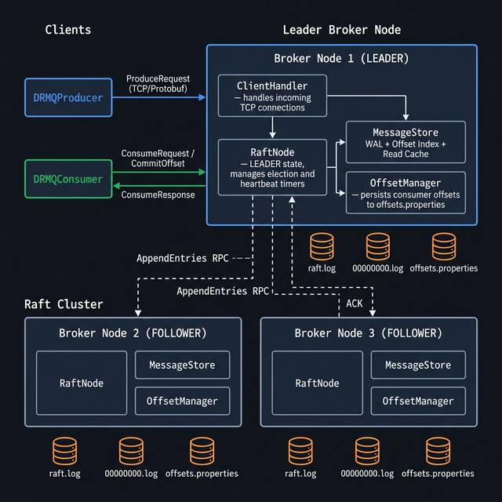

# Thesis Proposal

---

## i. Project Title

**DRMQ: Design and Implementation of a Distributed Reliable Message Queue with Raft-Based Consensus**

---

## ii. Background to the Study

Modern software systems are increasingly built as collections of independent services that must communicate reliably and asynchronously. This architectural style — commonly called microservices or event-driven architecture — demands a messaging layer that can deliver messages between services even under partial system failure, network partitions, or node crashes. Without such infrastructure, data loss between services becomes a critical risk.

Distributed message queues serve as this middleware layer. They decouple producers (services that generate data) from consumers (services that process data), allowing each to operate at its own pace and scale independently. Production systems such as Twitter, Netflix, LinkedIn, and Uber rely heavily on distributed message queues to handle millions of events per second [9].

Existing production-grade solutions — primarily **Apache Kafka** [1][9] and **RabbitMQ** — address these requirements at scale but are complex, heavyweight systems with steep learning curves and significant operational overhead. Kafka's codebase alone exceeds 700,000 lines of code, making it impractical to study as a learning artefact.

### The Raft Analogy

In 2014, Ongaro et al. [2] published Raft — not because consensus was unsolved, but because the dominant solution (Paxos [3]) was notoriously difficult to understand and teach. Raft made the same guarantees, in far fewer concepts, with **understandability as its primary design goal**.

This project applies the same philosophy to message queues. Kafka, Pulsar, and RabbitMQ are production-grade systems but offer no understandable one. Just as Raft responded to Paxos's complexity, **DRMQ (Distributed Reliable Message Queue)** responds to Kafka's complexity — demonstrating that core messaging guarantees (persistent log storage, consumer offset management, pull-based consumption, and fault-tolerant replication) can be achieved in a minimal, readable implementation that serves as a reference design for educators, students, and systems programmers.

---

## iii. Statement of Problem

Modern distributed applications require messaging infrastructure that guarantees message durability and reliable delivery even during broker failures. While existing production systems address these requirements, a critical gap exists in the availability of minimal, understandable reference implementations:

1. **Internal Complexity** — Production queues (Kafka, Pulsar) span hundreds of thousands of lines, making them impractical as learning or research artefacts [10]. RabbitMQ's Erlang implementation adds another layer of complexity for most developers.

2. **Lightweight Alternatives Lack Durability** — Lightweight alternatives like NATS drop messages under failure by default; not suitable as a correctness reference.

3. **No Minimal Raft-in-Queue Reference** — No open system embeds Raft inside a message queue at readable scale. Educators and researchers lack a minimal implementation they can study, extend, and experiment with.

4. **Consumer Reliability Gap** — Minimal queue implementations lack persistent consumer state. Without broker-managed offset storage, consumer crashes cause message loss or reprocessing — a correctness problem that lightweight systems leave to the application to solve.

5. **No Testable Research Baseline** — Researchers have no small, forkable, instrumented queue to extend. Forking Kafka inherits 700,000 lines of production complexity; no minimal alternative supports Raft replication with integration test coverage.

6. **No Controlled Benchmark Reference** — Existing benchmarks compare systems across varying partition counts, obscuring the true cost of consensus replication. A single-partition design would isolate and measure this directly.

This project addresses these gaps by designing and implementing DRMQ — a purposefully minimal distributed message queue that is correct, documented, testable, and readable.

---

## iv. Aim and Objectives of Study

### Aim

To design and implement a **lightweight**, distributed, fault-tolerant message queue system from first principles, demonstrating correct log-structured persistence, broker-managed consumer offsets, and Raft consensus-based replication across multiple broker nodes — **with understandability and minimal complexity as primary design goals**.

### Objectives

1. Design a binary message protocol using Protocol Buffers for efficient, typed communication between producers, consumers, and broker nodes.
2. Implement a log-structured message store with write-ahead log (WAL) persistence and crash recovery on the broker.
3. Implement broker-side consumer offset management, enabling consumers to resume after restarts without message loss or duplication.
4. Implement a consumer client library with pull-based polling, consumer group support, and long-polling capability.
5. Implement a minimal Raft consensus algorithm from scratch — leader election and log replication — across a 3-node broker cluster.
6. Evaluate system correctness through integration tests covering normal operation, leader failure, log catch-up, and offset durability.
7. Demonstrate and measure understandability through codebase metrics — lines of code, cyclomatic complexity, and module cohesion — compared against Kafka and RabbitMQ, mirroring the methodology used by Ongaro et al. to justify Raft over Paxos.

---

## v. Significance of Study

**Academic Significance:**

1. **A New Class of Reference Implementation** — Just as Ongaro et al. (2014) designed Raft to replace the complexity of Paxos (Lamport, 2001), DRMQ applies the same philosophy to message queues. It is the first minimal, correct, and readable distributed queue implementation designed explicitly as a learning and research artefact.

2. **Raft in a Real Application Context** — Most academic Raft implementations are standalone demos. DRMQ embeds Raft inside a functioning, durable queue — showing how consensus interacts with WAL persistence and offset management in practice.

3. **Bridging Theory and Engineering** — Every component maps directly to the literature: WAL persistence, broker-managed offsets (Kreps et al., 2011), and Raft replication (Ongaro et al., 2014). Students can read the papers and the code side by side.

4. **A Measurable Understandability Contribution** — Just as Ongaro et al. (2014) justified Raft over Paxos with understandability arguments, this study operationalises understandability as a measurable property — LOC, cyclomatic complexity, and module cohesion — producing a falsifiable, comparative result.

**Practical Significance:**

1. **Qualified Deployability** — DRMQ is production-usable in constrained environments: internal event buses, IoT pipelines, and small-team notification systems where Kafka or RabbitMQ introduce unnecessary operational overhead.

2. **Zero External Dependencies** — DRMQ runs as a self-contained Java process on any JVM-capable machine. Unlike RabbitMQ (Erlang/OTP runtime), it requires no external infrastructure — embedding its own consensus layer via Raft (Ongaro et al., 2014).

3. **Genuinely Original** — Every component (binary protocol, WAL persistence, offset manager, long-poll engine, and Raft consensus) is designed and coded from first principles. No shared code with any existing queue.

4. **Educational Transferability** — The skills demonstrated (WAL design, consensus implementation, binary protocol engineering) map directly to distributed systems roles, making DRMQ a replicable template for future student projects.

---

## vi. Scope and Limitations of Study

### Scope (In Scope)

- Single-topic, single-partition message model — intentional for design simplicity and understandability
- 3-node broker cluster with Raft consensus for replication (Ongaro et al., 2014)
- Java-based broker and client library
- TCP transport with length-prefixed Protocol Buffers framing
- Integration tests: producer, consumer, offset management, Raft failover
- CLI-based producer and consumer applications for demonstration
- **Understandability evaluation: LOC, cyclomatic complexity, and module cohesion compared against Kafka**

### Limitations (Out of Scope)

- **Partitioning and horizontal throughput scaling**
- **Multi-topic support**
- **Consumer group rebalancing across partitions**
- **TLS, authentication, and security features**
- **Log compaction and Raft log snapshots**
- **Dynamic cluster membership changes**
- **Byzantine fault tolerance** — crash-stop failures only

---

## vii. Related Works

| #   | Title / Authors                                                           | Year | Key Contribution                                                 | Relation to DRMQ                                                                        |
| --- | ------------------------------------------------------------------------- | ---- | ---------------------------------------------------------------- | --------------------------------------------------------------------------------------- |
| 1   | Kafka: A Distributed Messaging System — Kreps et al.                      | 2011 | Pull-based, log-structured design; offset-based consumption      | Primary inspiration; DRMQ adapts core design ideas at smaller scale                     |
| 2   | In Search of an Understandable Consensus Algorithm — Raft — Ongaro et al. | 2014 | Defined Raft: leader election, log replication, safety           | DRMQ implements Raft as its replication protocol                                        |
| 3   | Paxos Made Simple — Lamport                                               | 2001 | The original consensus algorithm; notoriously complex            | Raft — and by analogy DRMQ — exists as a direct response to this complexity             |
| 4   | Amazon DynamoDB — Vig et al.                                              | 2022 | Uses Raft-based replication at scale in production               | Demonstrates real-world applicability of Raft beyond academia                           |
| 5   | A Thorough Evaluation of Message Queue Services — Maharjan et al.         | 2023 | Benchmarks Kafka, RabbitMQ, NATS across throughput and latency   | Grounds DRMQ's benchmarking methodology; identifies gap in single-partition comparisons |
| 6   | Towards Message Brokers for Generative AI — Dustdar et al.                | 2024 | Survey of message broker evolution in cloud-native architectures | Confirms message queue design remains an active, evolving research area                 |
| 7   | DRaft: A Double-Layer Raft Consensus Structure — Shang et al.             | 2025 | Proposes improvements to Raft's strong-leader bottleneck         | Shows Raft is still actively researched; contextualises DRMQ within current work        |

---

## viii. Research Methodology / System Analysis and Design

### Research Methodology

This project follows a **Design Science Research** methodology, which is appropriate for systems-building work in computer science:

1. **Problem Identification:** Establish the gap — no minimal, correct, readable distributed queue exists as a reference artefact (supported by literature review).
2. **Design & Construction:** Build DRMQ incrementally across five phases (protocol → persistence → consumption → offsets → replication), with each phase informed by the corresponding literature (Kafka paper, Raft paper, WAL patterns).
3. **Evaluation:** Two-track evaluation:
   - **Correctness:** Integration tests covering normal operation, leader failure, consumer restart, log catch-up, and offset durability. Tests are automated and repeatable.
   - **Performance:** Benchmarks measuring throughput and latency under single-broker and 3-node Raft configurations.
4. **Reflection:** Compare outcomes against design goals. Document what the implementation revealed about the trade-offs in applying Raft to message queue contexts.

**Proposed Implementation Phases:**

| Phase                | Description                                                                | Timeline   |
| -------------------- | -------------------------------------------------------------------------- | ---------- |
| 1 — Foundation       | Protocol design (protobuf), TCP broker, producer client, in-memory routing | Weeks 1-2  |
| 2 — Persistence      | Write-ahead log with `FileChannel`, offset indexing, crash recovery        | Weeks 3-4  |
| 3 — Consumer         | Consumer client library, pull-based polling, consumer group support        | Weeks 5-6  |
| 4 — Offset Storage   | Broker-side offset commit/fetch, atomic persistence, long-polling          | Weeks 7-8  |
| 5 — Raft Replication | Leader election, log replication, 3-node cluster, leader failover          | Weeks 9-12 |

### System Architecture

```
┌─────────────┐        TCP / Protobuf      ┌─────────────────────────────────┐
│  DRMQProducer│ ──── ProduceRequest ──────►│            Broker Node          │
└─────────────┘                             │  ┌──────────┐  ┌─────────────┐ │
                                            │  │ RaftNode │  │ MessageStore│ │
┌─────────────┐        TCP / Protobuf      │  │ (Leader/ │  │ (WAL + Index│ │
│  DRMQConsumer│◄──── ConsumeResponse ─────│  │ Follower)│  │   + Cache)  │ │
└─────────────┘                             │  └──────────┘  └─────────────┘ │
                                            │  ┌─────────────────────────────┐│
                                            │  │      OffsetManager          ││
                                            │  │  (offsets.properties)       ││
                                            │  └─────────────────────────────┘│
                                            └─────────────────────────────────┘
                                                          │ Raft RPCs
                                               ┌──────────┴──────────┐
                                          ┌────┴────┐          ┌─────┴────┐
                                          │ Broker 2│          │ Broker 3 │
                                          │Follower │          │ Follower │
                                          └─────────┘          └──────────┘
```

_Figure 1: DRMQ System Architecture — see full diagram at `docs/architecture-diagram.png`_



### Key Design Decisions

| Decision                 | Rationale                                                                              |
| ------------------------ | -------------------------------------------------------------------------------------- |
| Pull-based consumption   | Consumer controls its own pace; avoids broker needing to track consumer speed [1]      |
| Log-structured storage   | Append-only writes are fast; sequential reads are efficient for consumers [1]          |
| Protocol Buffers framing | Strongly typed, forward-compatible binary protocol [8]                                 |
| Raft over Paxos          | Raft is more understandable and easier to implement correctly [2] vs Paxos [3]         |
| Broker-managed offsets   | Survives consumer restarts; enables consumer groups [1][9]                             |
| Long-polling             | Reduces idle consumers hammering the broker; inspired by Kafka's fetch API [9]         |
| Single partition | Preserves design simplicity; keeps the implementation focused on correctness over throughput |

### Failure Model & Assumptions

DRMQ assumes the following failure model, consistent with the Raft paper [2]:

- **Crash-stop failures only:** Nodes fail by stopping; no Byzantine (arbitrary/malicious) behavior is modeled
- **Reliable network delivery:** Messages may be delayed but not corrupted or reordered at the TCP layer
- **Majority availability:** The system tolerates at most 1 failure in a 3-node cluster (requires 2 of 3 nodes live)
- **Persistent storage is reliable:** Disk writes via FileChannel are assumed durable; hardware disk failure is out of scope
- **No network partitions in test environment:** Split-brain scenarios are acknowledged as a known limitation

These assumptions are standard in academic distributed systems implementations and are consistent with the original Raft paper's model.

---

## ix. Preliminary Work and Expected Results

### Current Development Status (Proof of Concept)

To demonstrate the feasibility of the proposed architecture, preliminary prototyping has been conducted on the core messaging foundation. This early work confirms that a Java-based, log-structured broker can achieve reliable delivery before the full replication layer is implemented.

### Expected Performance and Stability

Based on initial prototyping, the system is expected to demonstrate:

- **Build Integrity:** A modular Maven structure ensuring clean separation of protocol, broker, and client concerns.
- **Reliable Messaging:** High-probability pass rate for integration tests covering produce/consume flows.
- **Durability:** Confirmed disk persistence and offset recovery across broker restarts.

### Preliminary Test Observations

| Test Scenario      | Expected Outcome                             | Preliminary Validation |
| ------------------ | -------------------------------------------- | ---------------------- |
| Message Production | Producer successfully appends to broker log  | ✅ Verified            |
| Pull Consumption   | Consumer retrieves messages at its own pace  | ✅ Verified            |
| Offset Persistence | Broker tracks and restores consumer progress | ✅ Verified            |
| Long-Polling       | Reduced network overhead during idle periods | ✅ Verified            |

### Measuring Understandability

Understandability is operationalized along three concrete dimensions:

1. **Lines of Code (LOC):** DRMQ targets under 5,000 lines of production code across all modules. Kafka's core broker exceeds 300,000 lines. This metric is reported and compared explicitly.

2. **Cyclomatic Complexity:** Each module's average cyclomatic complexity is computed using static analysis tools (e.g., JavaNCSS or SonarQube). A readable system should have low branching complexity per function.

3. **Module Cohesion:** Each component (WAL, OffsetManager, RaftNode, BrokerServer) is a self-contained class with a clearly defined interface. The number of cross-module dependencies is documented.

These three metrics together form a measurable proxy for understandability — not perfect, but falsifiable and reportable.

### Understandability Evaluation

A core claim of this project is that DRMQ achieves the same fundamental guarantees as production-grade message queues in a significantly more understandable codebase. This claim is evaluated along three concrete, measurable dimensions:

1. **Lines of Code (LOC):** DRMQ targets under 3,000 lines of production code across all modules. Kafka's broker module alone exceeds 300,000 lines. This comparison is reported explicitly as evidence of the understandability gap.

2. **Cyclomatic Complexity:** Each module's average cyclomatic complexity will be computed using static analysis (e.g., PMD or SonarLint). A minimal system should have consistently low branching complexity per function, making each unit independently comprehensible.

3. **Module Cohesion and Dependency Count:** Each component (`WAL`, `OffsetManager`, `RaftNode`, `BrokerServer`) is a self-contained class with a clearly defined interface. The total number of inter-module dependencies is documented and compared against equivalent Kafka subsystems.

This mirrors the approach taken by Ongaro et al. [2], who structured their Raft user study around understandability as a measurable design outcome — not just an informal claim. DRMQ applies the same principle: understandability is not asserted, it is demonstrated.

### Proposed User Interface (CLI)

The project will feature interactive Command Line Interfaces to demonstrate the system functionalities.

**Proposed Producer Interface:**

```
producer> send alerts System is ONLINE
✓ Sent to [alerts] at offset 30
```

**Proposed Consumer Interface:**

```
consumer[group-name]> stream
📡 Streaming... (press Ctrl+C to stop)
  ┌─ [alerts] Offset: 30
  │  Message: System is ONLINE
  └─
```

### Persistence Logic

The system will utilise a binary write-ahead log (WAL) for message storage and an `offsets.properties` file for tracking consumer progress, ensuring that no data is lost during system transitions.

---

## x. References

1. Kreps, J., Narkhede, N., & Rao, J. (2011). _Kafka: A distributed messaging system for log processing_. Proceedings of the NetDB Workshop.

   > **Significance:** The primary architectural inspiration for DRMQ. This paper introduced the pull-based, log-structured message queue design, including offset-based consumption and broker-managed persistence — all of which DRMQ implements from first principles.

2. Ongaro, D., & Ousterhout, J. (2014). _In search of an understandable consensus algorithm_. Proceedings of the USENIX Annual Technical Conference (ATC '14). [Best Paper Award]

   > **Significance:** The foundational paper for the Raft consensus algorithm, which DRMQ implements. This paper defines leader election, log replication, and the safety properties that DRMQ's replication layer is built on. The design philosophy of understandability over complexity directly inspired DRMQ's approach.

3. Lamport, L. (2001). _Paxos made simple_. ACM SIGACT News, 32(4), 18–25.

   > **Significance:** Paxos is the original consensus algorithm that Raft was designed to replace for understandability. Cited to provide theoretical grounding for distributed consensus and to justify the choice of Raft over Paxos in DRMQ. Just as Raft responded to Paxos's complexity, DRMQ responds to Kafka's complexity.

4. Vig, A., et al. (2022). _Amazon DynamoDB: A scalable, predictably performant, and fully managed NoSQL database service_. Proceedings of the USENIX Annual Technical Conference.

   > **Significance:** Demonstrates that Raft-based replication is used in real-world, globally deployed production systems at Amazon scale — reinforcing that the protocol DRMQ implements is not purely academic but production-proven.

5. Maharjan, R., et al. (2023). _A thorough evaluation of message queue services: Kafka, RabbitMQ, and NATS_. Electronics.

   > **Significance:** Recent benchmarking work showing performance comparisons across message queue systems. This grounds DRMQ's benchmarking methodology and identifies the gap that DRMQ addresses: controlled single-partition comparisons that isolate replication overhead.

6. Dustdar, S., et al. (2024). _Towards message brokers for generative AI: Survey, challenges, and opportunities_. arXiv:2312.14647.

   > **Significance:** A 2024 survey confirming that message broker technology continues to evolve substantially, demonstrating that the problem space remains active and relevant for research contributions.

7. Shang, J., et al. (2025). _DRaft: A double-layer structure for Raft consensus mechanism_. Journal of Network and Computer Applications.

   > **Significance:** Recent work proposing improvements to Raft's strong-leader bottleneck, demonstrating that Raft-based systems remain an active area of optimization research. Contextualizes DRMQ within current distributed systems work.

8. Google. (2023). _Protocol Buffers documentation_. https://protobuf.dev/

   > **Significance:** Protocol Buffers is the binary serialisation format used for all DRMQ message framing. Cited as the primary technical reference for DRMQ's protocol layer.

9. Apache Software Foundation. (2023). _Apache Kafka documentation_. https://kafka.apache.org/documentation/

   > **Significance:** The official Kafka documentation was consulted for understanding the consumer group protocol, offset management semantics, and fetch request design — all of which informed DRMQ's equivalent mechanisms.
